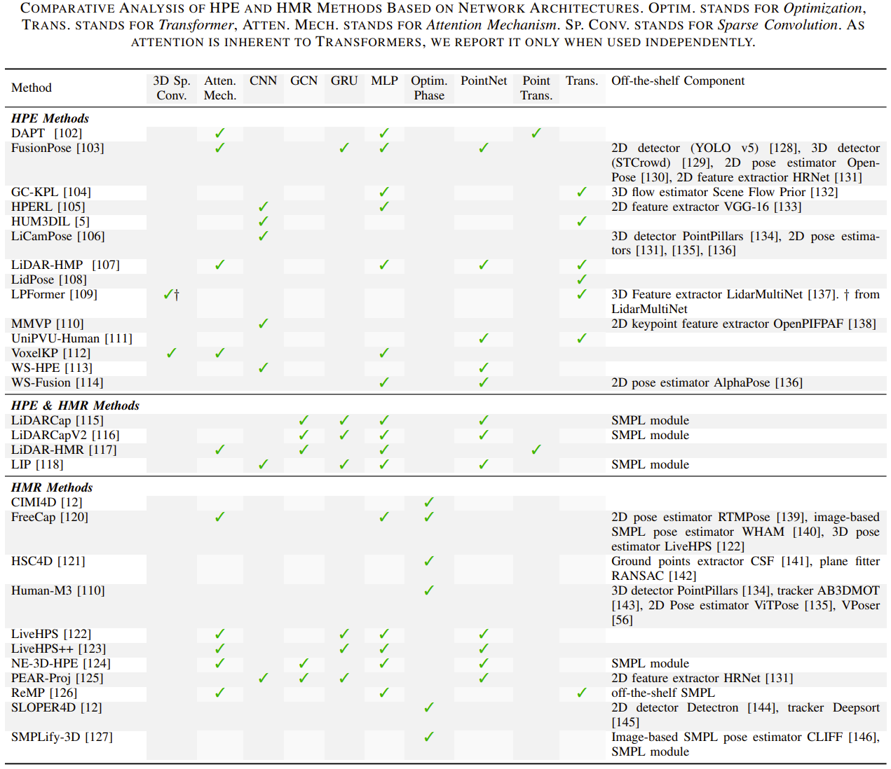

# A Repository of Papers on 3D Human Pose and Shape Estimation from LiDAR Point Clouds

This repository provides an up-to-date collection of papers focused on 3D Human Pose and Shape Estimation from LiDAR Point Clouds. The organization of the repository follows the taxonomy introduced in the paper below. Please cite our paper if you benefit from this repository:

S. Galaaoui, E. Valle, D. Picard, N.Samet, "3D Human Pose and Shape Estimation from LiDAR Point Clouds: A Review", arXiv, 2025. [[preprint]](https://arxiv.org/abs/????)

BibTeX entry:
```
@ARTICLE{lidarhpehmr,
       author = {Salma Galaaoui and Eduardo Valle and David Picard and Nermin Samet},
        title = "{3D Human Pose and Shape Estimation from LiDAR Point Clouds: A Review}",
        journal = {arXiv},
        year = "2025"
        }
```


## How to request addition of a paper

If you know of a paper on 3D Human Pose Estimation or Human Mesh Reconstruction from LiDAR Point Clouds, you are welcome to contribute by submitting a pull request. In your submission, please indicate the section where your paper fits best within the repository’s taxonomy.

## Contact

Please contact Salma Galaaoui (salma.galaaoui@valeo.com) for your questions.

# Table of Contents 

1. [Overview of 3D Human Pose Estimation or Human Mesh Reconstruction Methods from LiDAR Point Clouds](#1)  
    1.1 [Comparative Summary of Human Pose Estimation or Human Mesh Reconstruction Methods](#1.1)  
    1.2 [Comparing Network Architectures of Human Pose Estimation or Human Mesh Reconstruction Methods](#1.2)  
2. [3D Human Pose Estimation From LIDAR Point Clouds](#2)  
    2.1 [Supervised Human Pose Estimation](#2.1)  
    2.2 [Weakly-supervised Human Pose Estimation](#2.2)    
    2.3 [Unsupervised Human Pose Estimation](#2.3)    
3. [3D Human Mesh Reconstruction From LIDAR Point Clouds](#3)  
    3.1 [LiDAR-Only Human Mesh Reconstruction](#3.1)  
    3.2 [Fusing LiDAR and Other Modalities for Human Mesh Reconstruction](#3.2)    
4. [Datasets](#4)  
    4.1 [Waymo Open Dataset](#4.1)  
    4.2 [SLOPER4D](#4.2)  
    4.3 [Human-M3](#4.3)  

# 1. 3D Human Pose Estimation From LIDAR Point Clouds <a name="1"></a>

## 1.1. Comparative Summary of Human Pose Estimation or Human Mesh Reconstruction Methods <a name="1.1"></a>


## 1.2. Comparing Network Architectures of Human Pose Estimation or Human Mesh Reconstruction Methods <a name="1.2"></a>


# 2. 3D Human Pose Estimation From LIDAR Point Clouds <a name="2"></a>

## 2.1. Supervised Human Pose Estimation <a name="2.1"></a>
- DAPT, AAAI 2025, [[paper]](https://arxiv.org/abs/2412.13454) 
- LiDAR-HMP, ACM Multimedia 2024, [[paper]](http://arxiv.org/abs/2408.08202) 
- LidPose, Sensors 2024, [[paper]](https://www.mdpi.com/1424-8220/24/11/3427)
- LPFormer, ICRA 2024, [[paper]](https://arxiv.org/abs/2306.12525) 
- MMVP, arXiv 2023, [[paper]](https://arxiv.org/abs/2308.00628) 
- PCAR, ICRA 2023, [[paper]](https://arxiv.org/abs/2306.01075) 
- UniPVU-Human, CVPR 2024, [[paper]](https://arxiv.org/abs/2403.20031) 
- VoxelKP, ICCV 2025, [[paper]](https://arxiv.org/abs/2312.08871) 

## 2.2. Weakly-supervised Human Pose Estimation  <a name="2.2"></a>

- FusionPose, AAAI 2023, [[paper]](https://arxiv.org/abs/2211.16951)
- HPERL, ICPR 2020, [[paper]](https://arxiv.org/abs/2212.07729)
- HUM3DIL, CoRL 2022, [[paper]](https://arxiv.org/abs/2212.07729)
- LiCamPose, WACV 2025, [[paper]](https://arxiv.org/abs/2312.06409)
- SA-VR system, arXiv 2024, [[paper]](https://arxiv.org/abs/2405.01112) 
- WS-HPE, CVPRW 2020, [[paper]](https://arxiv.org/abs/2112.12141)
- WS-Fusion, IEEE-IV 2023, [[paper]](https://arxiv.org/abs/2307.14889)

## 2.3. Unsupervised Human Pose Estimation <a name="2.3"></a>
- GC-KPL, CVPR 2023, [[paper]](https://arxiv.org/abs/2306.04745)

# 3. 3D Human Mesh Reconstruction From LIDAR Point Clouds <a name="3"></a>

## 3.1. LiDAR-Only Human Mesh Reconstruction <a name="3.1"></a>
- LiDARCap, CVPR 2022, [[paper]](https://arxiv.org/abs/2203.14698)
- LiDARCapV2, Pattern Recognition 2024, [[paper]](https://www.sciencedirect.com/science/article/abs/pii/S0031320324005995)
- LiDAR-HMR, arXiv 2025, [[paper]](https://arxiv.org/abs/2311.11971)
- LiveHPS, CVPR 2024, [[paper]](https://arxiv.org/abs/2402.17171)
- LiveHPS++, ECCV 2024, [[paper]](https://arxiv.org/abs/2407.09833) 
- NE-3D-HPE, AAAI 2024, [[paper]](https://ojs.aaai.org/index.php/AAAI/article/view/28545)

## 3.2. Fusing LiDAR and Other Modalities for Human Mesh Reconstruction <a name="3.2"></a>

- FreeCap. arXiv 2024, [[paper]](https://arxiv.org/abs/2411.04469) 
- HSC4D*, CVPR 2022, [[paper]](https://arxiv.org/abs/2203.09215) 
- Human-M3*, arXiv 2023, [[paper]](https://arxiv.org/abs/2308.00628) 
- LiDAR-aid Inertial Poser (LIP), IEEE Transactions on Visualization and Computer Graphics 2023, [[paper]](https://arxiv.org/abs/2205.15410) 
- PEAR-Proj, ACM Multimedia 2024, [[paper]](https://dl.acm.org/doi/10.1145/3664647.3681055) 
- SLOPER4D* , CVPR 2023, [[paper]](https://arxiv.org/abs/2303.09095) 
- SMPLify-3D, Master Thesis 2024, [[paper]](https://repository.tudelft.nl/record/uuid:7dc63e73-b793-4430-b9e0-26df378a20d9) 

 \* The annotation pipeline employs mesh reconstruction for 3D data labeling.

# 4. Datasets <a name="4"></a>

## 4.1. Waymo Open Dataset <a name="4.1"></a>

- **Dataset Name and Version**
  - Waymo Open Dataset - Perception
  - Latest versions: v1.4.3 (including maps as polylines and polygons) or v2.0.1 (same data but without maps)
 
- **Overview**
  - Waymo Open Dataset is a large corpus of autonomous driving related data and scenarios. It comprises two large datasets: Motion and Perception, the latter being the one of focus for this survey. The Motion Dataset in its latest version contains LiDAR captures of 103,354 scenarios each containing 20 seconds of tracked vehicles, objects, and humans in addition to camera embeddings. The Perception dataset, as its name indicates, is focused on perception and provides annotated rich sensor data captured from LiDAR sensors and cameras mounted on Waymo vehicles.

- **Data Collection**
  - **Methodology**: The data is collected using LiDAR sensors and high-resolution cameras mounted on Waymo vehicles. The vehicles have 5 in-house LiDARs mounted: one mid-range sensor on the top and four short-range sensors on the front, side left, side right, and rear. The LiDAR beams are truncated to 70 meters for the top sensor and 20 meters for the rest. Only the first two returns of the sensors are kept. In addition, RGB data is collected from 5 cameras associated with the following directions: front, front left, front right, side left, and side right. The images are saved in JPEG format. Additional information is provided to customize the LiDAR to camera projection.
  - **Time period of data collection**: Initial release in 2019. Post-processing lasted until April 2024 as per Waymo's website.
  - **Geographic coverage**: The majority of scenes were recorded in San Francisco, Phoenix, and Mountain View with data collected at various times of the day and night.

- **Data Format and Structure**
  - Data is stored in folders according to annotation type (e.g., human keypoints, bounding box, camera labels, etc.) and each label is stored using Apache Parquet format.
  - Dataset is organized into sequences of 20 seconds each with multiple sensor inputs per sequence sampled at 10Hz.

- **Intended Use and Tasks**
  - The Perception dataset supports tasks related to machine extroception and could be used for the following tasks:
    - 2D/3D object detection
    - 2D/3D tracking
    - 2D/3D segmentation
    - 2D video panoptic segmentation
    - 2D/3D human pose estimation
    - Action/motion recognition/prediction

- **Ethical Considerations**
  - Privacy and anonymization measures
  - Potential ethical issues or concerns

- **Accessibility and Licensing**
  - How to access the dataset (e.g., download link, API)
  - Licensing information and usage restrictions


## 4.2. SLOPER4D <a name="4.2"></a>
- **Dataset Name and Version**
  - SLOPER4D - Scene Aware Dataset for Global 4D Human Pose Estimation in Urban Environments
  - Latest version: v1.0 (partial release of scenes, only 6 out of 15)

- **Overview**
  - SLOPER4D is the first large-scale urban 3D Human Pose Estimation (HPE) dataset containing multi-modal capture data, including calibrated and synchronized IMU measurements, LiDAR point clouds, and images for each subject. It includes rich 3D annotations such as SMPL models and global locations in the world coordinate system. The dataset also provides the complete 3D scene mesh.

- **Data Collection**
  - **Methodology**: Data is collected using a person wearing a head-mounted LiDAR and camera, following a subject wearing IMUs performing mundane actions. The mounted LiDAR is an Ouster OS-1 mid-range LiDAR, oriented at 45° to better capture the performer. 

  - **Time period of data collection**: Initial release in 2023.

  - **Geographic coverage**: Chinese city – unknown.

- **Data Format and Structure**
  - Data is separated into folders containing per-sequence annotations. In each folder: LiDAR point cloud frames in PCD format, trajectories and tracking trajectories, MoCap data in BVH format, and a video of the sequence. Each sequence folder also includes a JSON file containing metadata.


- **Intended Use and Tasks**
  - Supports tasks related to machine extroception and could be used for the following tasks:
    - 2D/3D human tracking
    - 2D/3D human segmentation
    - 2D/3D human pose estimation
    - Action/motion recognition/prediction

- **Ethical Considerations**
  - Privacy and anonymization measures
  - Potential ethical issues or concerns

- **Accessibility and Licensing**
  - How to access the dataset (e.g., download link, API)
  - Licensing information and usage restrictions

# 5. Technical Details for Extracting Dataset Statistics <a name="5"></a>
**Waymo Open Dataset** 
We extract statics for Waymo mostly using their v4.0.1 Apache parquet files. We filter out objects labelled as pedestrian (label 2) and cyclist (label 4) following their labelling protocol file from their 'camera\_box' dataframes, then we compute average bounding box size. For the average distance from sensor and the number of 3D keypoint frames, we use the 'lidar\_hkp' dataframe and compute the average distance of the 14 keypoints that are already in LiDAR coordinate frame. We also report the horizontal resolution for the TOP Lidar and thus its pointcloud resolution from the 'lidar' dataframe. Finally for the 3D pose diversity we use postprocessed files from the authors of LiDAR-HMR that provide ground truth meshes generated using SiMPLify, we remove the rotation and translation and compute the average MSE between the posed ground truth mesh a T-posed mesh with the same betas, as show below.

**SLOPER4D** 
We extract our statistic integrally from the SLOPER4D v1.0 dataset files. Most information is available through their dataloader, we use their segmented human points which are in LiDAR coordinate frame to compute average points per instance as well as the average distance to sensor. For 3D pose diversity we use the same method we used with Waymo Open Dataset. We additionally compute average sequence length using the average number of RGB frames and the framerate. Note that we report our statistics based on the 6 out of 15 sequences released yielding 33k LiDAR frames instead of the 100k announced in their paper.

**Human-M3** 
TBD


*We compute 3D pose variability by aligning the posed SMPL model (purple) with the template model in T-pose (pink) and compute the MSE between the joints (orange and green respectively)*

